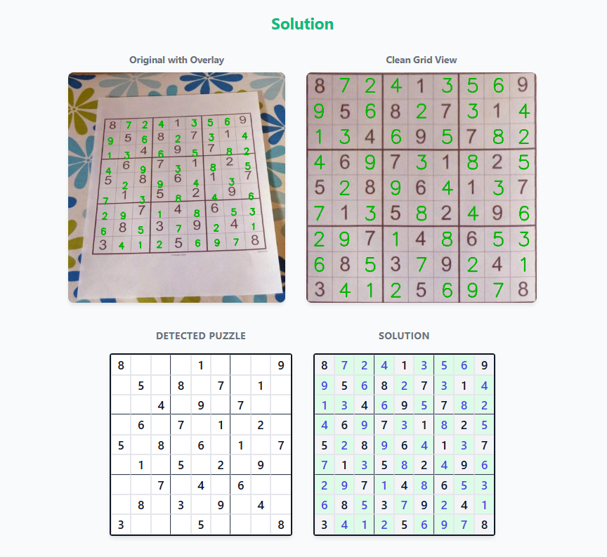

# 🧩 Sudoku CV Solver

A computer vision-based Sudoku solver that extracts puzzles from images and solves them using AI digit recognition and backtracking algorithms.


## ✨ Features

- 📷 **Image Processing**: Detect Sudoku grids from photos at any angle
- 🔢 **Digit Recognition**: CNN-based recognition trained on MNIST + printed digits
- 🧮 **Fast Solver**: Efficient backtracking algorithm with constraint propagation
- 🌐 **Web Interface**: Clean, responsive UI with drag-and-drop upload
- 📱 **Manual Input**: Enter puzzles manually with keyboard navigation

## 🖼️ Demo

.png)


## 🚀 Quick Start

### Prerequisites

- Python 3.8 or higher
- pip package manager

### Installation

1. **Clone the repository**
   ```bash
   git clone https://github.com/susnazariy/sudokuCV_CNN.git
   cd sudokuCV_CNN
   ```

2. **Create virtual environment** (recommended)
   ```bash
   python -m venv venv
   source venv/bin/activate  # On Windows: venv\Scripts\activate
   ```

3. **Install dependencies**
   ```bash
   pip install -r requirements.txt
   ```

4. **Train the digit recognition model (optinal, pretrained model can be used)**
   ```bash
   python train_combined.py --epoch 5
   ```
   This downloads MNIST and trains a CNN model (~2-5 minutes on CPU).

5. **Run the web application**
   ```bash
   python app.py
   ```

6. **Open in browser**
   ```
   http://localhost:5000
   ```

## 📖 Usage

### Web Interface

1. Navigate to `http://localhost:5000`
2. Choose **"From Image"** tab
3. Drag & drop or click to upload a Sudoku image
4. Click **"Solve Puzzle"**
5. View the solution overlaid on the original image

### Command Line

```bash
# Solve from image file
python solve.py path/to/sudoku.jpg

# Save result image
python solve.py path/to/sudoku.jpg --output result.png
```

### Python API

```python
from sudoku_cv import SudokuPipeline

# Initialize pipeline
pipeline = SudokuPipeline('best_digit_model.pth')

# Process image
result = pipeline.process_file('sudoku.jpg')

if result['success']:
    print("Detected:", result['puzzle'])
    print("Solution:", result['solution'])
```

## 📁 Project Structure

```
sudokuCV_CNN/
│
├── 📄 app.py                    # Flask web server & API endpoints
├── 📄 train.py                  # Basic MNIST training script
├── 📄 train_combined.py         # Combined MNIST + printed digits training
├── 📄 generate_printed_digits.py # Synthetic digit dataset generator
├── 📄 solve.py                  # Command-line interface
├── 📄 setup.py                  # Package installation script
├── 📄 requirements.txt          # Python dependencies
├── 📄 README.md                 # This file
├── 📄 LICENSE                   # MIT License
├── 📄 .gitignore                # Git ignore rules
│
├── 📁 sudoku_cv/                # Core computer vision package
│   ├── 📄 __init__.py           # Package exports
│   ├── 📄 preprocessing.py      # Image preprocessing utilities
│   ├── 📄 grid_detection.py     # Grid contour & corner detection
│   ├── 📄 cell_extraction.py    # Cell extraction & blank detection
│   ├── 📄 digit_recognition.py  # CNN model & inference
│   ├── 📄 solver.py             # Backtracking Sudoku solver
│   ├── 📄 visualization.py      # Solution overlay rendering
│   └── 📄 pipeline.py           # Main processing pipeline
│
├── 📁 static/                   # Web static assets
│   ├── 📁 css/
│   │   └── 📄 style.css         # UI styles
│   └── 📁 js/
│       └── 📄 app.js            # Frontend JavaScript
│
├── 📁 templates/                # HTML templates
│   └── 📄 index.html            # Main web page
│
├── 📁 data/                     # [Generated] Training data
│   └── 📁 MNIST/                # MNIST dataset (auto-downloaded)
│
└── 📁 printed_digits/           # [Generated] Synthetic digits
    ├── 📄 printed_digits.pkl    # Serialized dataset
    └── 📁 samples/              # Sample images for verification
```

### File Descriptions

#### Root Files

| File | Purpose |
|------|---------|
| `app.py` | Flask web server with REST API endpoints (`/api/solve/image`, `/api/solve/grid`). Handles image upload, base64 encoding, and JSON responses. |
| `train.py` | Basic training script using only MNIST dataset. Good for quick testing. |
| `train_combined.py` | Advanced training with 40% MNIST + 60% synthetic printed digits. Improves recognition of clean printed numbers. |
| `generate_printed_digits.py` | Creates synthetic digit images using system fonts. Generates variations with different fonts, sizes, and slight transformations. |
| `solve.py` | Command-line tool for solving puzzles from image files. Supports output saving. |
| `setup.py` | Setuptools configuration for `pip install -e .` development installation. |
| `requirements.txt` | Python package dependencies with version constraints. |

#### Core Package (`sudoku_cv/`)

| File | Purpose |
|------|---------|
| `__init__.py` | Package initialization. Exports main classes: `SudokuPipeline`, `SudokuSolver`, `DigitRecognizer`. |
| `preprocessing.py` | Image preprocessing functions: grayscale conversion, Gaussian blur, adaptive thresholding (handles varying lighting). |
| `grid_detection.py` | Grid detection using contour analysis. Finds largest quadrilateral, orders corners (TL→TR→BR→BL), applies perspective transform. |
| `cell_extraction.py` | Extracts 81 cells using morphological line detection. Classifies cells as blank/filled using adaptive thresholding and connected component analysis. |
| `digit_recognition.py` | CNN model definition and inference. Loads trained weights, preprocesses cells, returns digit predictions with confidence scores. |
| `solver.py` | Constraint-propagation backtracking solver. Validates puzzles, finds solutions, detects invalid/unsolvable states. |
| `visualization.py` | Renders solution overlay on original image. Uses inverse perspective transform for accurate digit placement. |
| `pipeline.py` | Orchestrates entire workflow. Main entry point: `SudokuPipeline.process_image()`. |

#### Web Interface (`static/`, `templates/`)

| File | Purpose |
|------|---------|
| `templates/index.html` | Main HTML page with tab navigation, drop zone, grid displays. |
| `static/css/style.css` | CSS styling: dark theme variables, responsive grid layout, animations. |
| `static/js/app.js` | Frontend logic: drag-drop handling, API calls, grid rendering, keyboard navigation. |

---

## 🔧 Configuration

### Environment Variables

| Variable | Default | Description |
|----------|---------|-------------|
| `MODEL_PATH` | `best_digit_model.pth` | Path to trained model |
| `PORT` | `5000` | Web server port |
| `DEBUG` | `false` | Enable debug mode |


## 🧪 How It Works

1. **Preprocessing**: Convert to grayscale, apply adaptive thresholding
2. **Grid Detection**: Find largest quadrilateral contour
3. **Perspective Transform**: Warp grid to square image
4. **Cell Extraction**: Divide into 81 cells, detect grid lines
5. **Digit Recognition**: CNN classifies each cell (0-9)
6. **Solving**: Backtracking with constraint propagation
7. **Visualization**: Overlay solution on original image

## 📊 Model Performance

- **MNIST Accuracy**: ~97%
- **Printed Digits**: ~98%

## 🤝 Contributing

Contributions are welcome! Please feel free to submit a Pull Request.

1. Fork the repository
2. Create your feature branch (`git checkout -b feature/AmazingFeature`)
3. Commit your changes (`git commit -m 'Add some AmazingFeature'`)
4. Push to the branch (`git push origin feature/AmazingFeature`)
5. Open a Pull Request

## 📝 License

This project is licensed under the MIT License - see the [LICENSE](LICENSE) file for details.

## 🙏 Acknowledgments

- [MNIST Dataset](http://yann.lecun.com/exdb/mnist/) for digit recognition training
- [OpenCV](https://opencv.org/) for image processing
- [PyTorch](https://pytorch.org/) for deep learning
